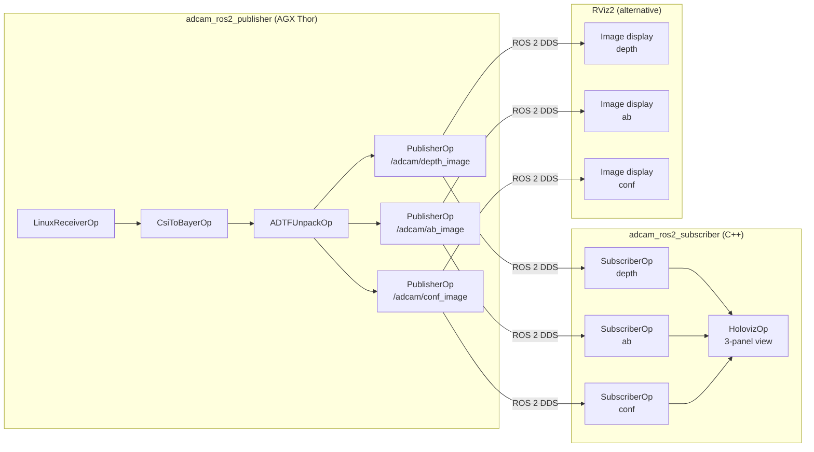

# ADI ToF (adcam) → ROS 2 Publisher/Subscriber

Source: `holoscan-sensor-bridge/examples/aditof/cpp/` (branch `demo_HSB_ToF_ROS2` @ HSB 2.5.0)

---

## Overview

This document describes how to convert the existing `adcam_player.cpp`
(a standalone Holoscan viewer for the ADI ADTF3175 ToF camera) into a
**ROS 2 publisher/subscriber architecture** that publishes Depth, AB (Active Brightness),
and Confidence images to ROS 2 topics and subscribes to them for visualization.

The reference for the ROS 2 integration pattern is the
`holohub/applications/holoscan_ros2/vb1940/` example.

---

## Does This Require InfiniBand (IBV)?

**No — InfiniBand is NOT required for this use case on AGX Thor + JP 7.0 + HSB 2.5.0.**

The `adcam_player.cpp` supports **two receiver paths**:

| Receiver | IBV required? | JP 7.0 support | Used when |
|---|---|---|---|
| `LinuxReceiverOp` | ❌ No | ✅ Yes | `ibv_name` is empty (auto-selected on JP 7.0) |
| `RoceReceiverOp` | ✅ Yes | ❌ No (added in HSB 2.6-EA2, JP 7.1) | `ibv_name` is set |

The application **auto-detects** IBV at startup:

```cpp
// adcam_player.cpp
auto devices = hololink::infiniband_devices();
ibv_name = devices.size() > 0 ? devices[0] : "";
// If no IBV found → ibv_name is empty → LinuxReceiverOp is used
```

On JP 7.0 + HSB 2.5.0, `ibv_devinfo` returns `"No IB devices found"` →
`ibv_name` is empty → `LinuxReceiverOp` is **automatically selected**.

---

## aditof Data Path (HSB hardware — not USB)

The `adcam_player` uses the **Holoscan Sensor Bridge (HSB) hardware**.
This is different from the `adi_3dtof_adtf31xx` ROS 2 package which uses USB + libaditof.

```
ADI ADTF3175 ToF Sensor
    ↓  MIPI CSI-2 (raw phase/amplitude data)
ADSD3500 Dual Depth Processor
    ↓  Phase → Depth, calibration, filtering
    ↓  Outputs: Depth (16-bit), AB (16-bit), Confidence (8-bit) via MIPI
HSB FPGA (Holoscan Sensor Bridge @ 192.168.0.2)
    ↓  Packetizes frames into UDP packets over 10GigE
LinuxReceiverOp   (JP 7.0, no IBV needed)
    ↓
CsiToBayerOp      (CSI-2 raw → Bayer pattern, GPU)
    ↓
ADTFUnpackOp      (ADI 5-byte/pixel format → 3 planes: Depth / AB / Conf)
    ↓
HolovizOp         (LEFT: Depth | CENTER: AB | RIGHT: Conf)
```

---

## Current Operator Graph (`adcam_player.cpp`)

```cpp
// adcam_player.cpp compose() — operator connections
add_flow(receiver_operator,     csi_to_bayer_operator, {{"output", "input"}});
add_flow(csi_to_bayer_operator, ADIToF_data,           {{"output", "input"}});
add_flow(ADIToF_data,           visualizer,            {{"output", "receivers"}});
```

| Step | Operator | Output | Notes |
|---|---|---|---|
| 1 | `LinuxReceiverOp` / `RoceReceiverOp` | Raw CSI frame (GPU) | Auto-selected by IBV availability |
| 2 | `CsiToBayerOp` | Bayer pattern (GPU) | `BlockMemoryPool`, 2 blocks |
| 3 | `ADTFUnpackOp` | 3 tensors: `Depth`, `ActiveBrightness`, `Conf` | 5-byte/pixel → 16-bit planes |
| 4 | `HolovizOp` | Display (3 panels side-by-side) | **Replace with ROS 2 publishers** |

---

## Target Architecture

Replace `HolovizOp` with ROS 2 publishers. Add a separate subscriber that receives
the topics and feeds them to `HolovizOp`.

```
adcam_ros2_publisher                    adcam_ros2_subscriber
─────────────────────                   ──────────────────────────
LinuxReceiverOp                         SubscriberOp<Image> × 3
    ↓                                        ↓
CsiToBayerOp                            HolovizOp (3 panels)
    ↓
ADTFUnpackOp
    ↓
PublisherOp<Image> × 3  ──ROS2──▶  /adcam/depth_image
                                   /adcam/ab_image
                                   /adcam/conf_image
```

---

## Publisher: `adcam_ros2_publisher.cpp`

Replace the `HolovizOp` section in `adcam_player.cpp compose()` with three
`PublisherOp` instances, one per output plane.

```cpp
#include <holoscan/ros2/operators/publisher.hpp>
#include <holoscan/ros2/bridge.hpp>
#include <sensor_msgs/msg/image.hpp>

// --- Inside HoloscanApplication::compose() ---

// ROS 2 Bridge (one shared node for all publishers)
auto ros2_bridge = make_resource<holoscan::ros2::Bridge>(
    "adcam_bridge", "adcam_publisher_node");

// Publisher for Depth
auto depth_publisher = make_operator<holoscan::ros2::ops::PublisherOp<sensor_msgs::msg::Image>>(
    "depth_publisher",
    holoscan::Arg("ros2_bridge", ros2_bridge),
    holoscan::Arg("topic_name", std::string("/adcam/depth_image")),
    holoscan::Arg("qos", holoscan::ros2::QoS(10)));

// Publisher for Active Brightness
auto ab_publisher = make_operator<holoscan::ros2::ops::PublisherOp<sensor_msgs::msg::Image>>(
    "ab_publisher",
    holoscan::Arg("ros2_bridge", ros2_bridge),
    holoscan::Arg("topic_name", std::string("/adcam/ab_image")),
    holoscan::Arg("qos", holoscan::ros2::QoS(10)));

// Publisher for Confidence
auto conf_publisher = make_operator<holoscan::ros2::ops::PublisherOp<sensor_msgs::msg::Image>>(
    "conf_publisher",
    holoscan::Arg("ros2_bridge", ros2_bridge),
    holoscan::Arg("topic_name", std::string("/adcam/conf_image")),
    holoscan::Arg("qos", holoscan::ros2::QoS(10)));

// Connect pipeline (replace HolovizOp connections)
add_flow(receiver_operator,   csi_to_bayer_operator, {{"output", "input"}});
add_flow(csi_to_bayer_operator, ADIToF_data,         {{"output", "input"}});
add_flow(ADIToF_data, depth_publisher,  {{"Depth",            "input"}});
add_flow(ADIToF_data, ab_publisher,     {{"ActiveBrightness", "input"}});
add_flow(ADIToF_data, conf_publisher,   {{"Conf",             "input"}});
```

### Published Topics

| Topic | Type | Content | Encoding |
|---|---|---|---|
| `/adcam/depth_image` | `sensor_msgs/Image` | 16-bit depth (jet RGB colorized) | `rgb8` |
| `/adcam/ab_image` | `sensor_msgs/Image` | 16-bit AB (grayscale RGB) | `rgb8` |
| `/adcam/conf_image` | `sensor_msgs/Image` | 16-bit confidence (grayscale RGB) | `rgb8` |
| `/adcam/camera_info` | `sensor_msgs/CameraInfo` | Calibration (optional) | — |

---

## Subscriber: `adcam_ros2_subscriber.cpp`

Subscribe to the three topics and feed them to `HolovizOp` for the same
3-panel visualization as the original `adcam_player`.

```cpp
#include <holoscan/ros2/operators/subscriber.hpp>
#include <holoscan/ros2/bridge.hpp>
#include <sensor_msgs/msg/image.hpp>

class AdcamSubscriberApp : public holoscan::Application {
public:
    void compose() override {
        // ROS 2 Bridge
        auto bridge = make_resource<holoscan::ros2::Bridge>(
            "adcam_sub_bridge", "adcam_subscriber_node");

        // Subscriber for Depth
        auto depth_sub = make_operator<holoscan::ros2::ops::SubscriberOp<sensor_msgs::msg::Image>>(
            "depth_sub",
            holoscan::Arg("ros2_bridge", bridge),
            holoscan::Arg("topic_name", std::string("/adcam/depth_image")),
            holoscan::Arg("qos", holoscan::ros2::QoS(10)));

        // Subscriber for Active Brightness
        auto ab_sub = make_operator<holoscan::ros2::ops::SubscriberOp<sensor_msgs::msg::Image>>(
            "ab_sub",
            holoscan::Arg("ros2_bridge", bridge),
            holoscan::Arg("topic_name", std::string("/adcam/ab_image")),
            holoscan::Arg("qos", holoscan::ros2::QoS(10)));

        // Subscriber for Confidence
        auto conf_sub = make_operator<holoscan::ros2::ops::SubscriberOp<sensor_msgs::msg::Image>>(
            "conf_sub",
            holoscan::Arg("ros2_bridge", bridge),
            holoscan::Arg("topic_name", std::string("/adcam/conf_image")),
            holoscan::Arg("qos", holoscan::ros2::QoS(10)));

        // HolovizOp — same 3-panel layout as adcam_player
        holoscan::ops::HolovizOp::InputSpec left_spec{
            "depth_image", holoscan::ops::HolovizOp::InputType::COLOR};
        left_spec.views_ = {{0.0f, 0.0f, 0.33f, 1.0f}};

        holoscan::ops::HolovizOp::InputSpec center_spec{
            "ab_image", holoscan::ops::HolovizOp::InputType::COLOR};
        center_spec.views_ = {{0.33f, 0.0f, 0.33f, 1.0f}};

        holoscan::ops::HolovizOp::InputSpec right_spec{
            "conf_image", holoscan::ops::HolovizOp::InputType::COLOR};
        right_spec.views_ = {{0.66f, 0.0f, 0.34f, 1.0f}};

        auto visualizer = make_operator<holoscan::ops::HolovizOp>(
            "holoviz",
            holoscan::Arg("headless", false),
            holoscan::Arg("framebuffer_srgb", true),
            holoscan::Arg("tensors",
                std::vector<holoscan::ops::HolovizOp::InputSpec>{
                    left_spec, center_spec, right_spec}),
            holoscan::Arg("window_title", std::string("ADI ToF ROS2 Viewer")));

        // Connect: subscriber → holoviz
        add_flow(depth_sub,  visualizer, {{"output", "receivers"}});
        add_flow(ab_sub,     visualizer, {{"output", "receivers"}});
        add_flow(conf_sub,   visualizer, {{"output", "receivers"}});
    }
};

int main(int argc, char** argv) {
    rclcpp::init(argc, argv);
    AdcamSubscriberApp app;
    app.run();
    return 0;
}
```

---

## RViz — Alternative Viewer (no C++ code needed)

RViz2 can subscribe to any `sensor_msgs/Image` topic natively.
It requires no custom code and runs on the same machine or a remote host.

### Launch RViz2

```sh
source /opt/ros/jazzy/setup.bash
rviz2
```

### Add displays in RViz2

1. Click **Add** → **By topic**
2. Add `/adcam/depth_image` → **Image** display
3. Add `/adcam/ab_image` → **Image** display
4. Add `/adcam/conf_image` → **Image** display

Or use `rqt_image_view` for a simpler single-topic viewer:

```sh
ros2 run rqt_image_view rqt_image_view /adcam/depth_image
ros2 run rqt_image_view rqt_image_view /adcam/ab_image
ros2 run rqt_image_view rqt_image_view /adcam/conf_image
```

---

## C++ Subscriber vs RViz Comparison

| Aspect | C++ Subscriber (HolovizOp) | RViz2 |
|---|---|---|
| GPU rendering | Yes — Vulkan/CUDA interop | No — CPU rendering |
| Custom layout | Yes — 3-panel side-by-side | Yes — flexible panels |
| Requires build | Yes | No |
| Latency | Very low (GPU zero-copy) | Higher (CPU decode) |
| Best for | Production / performance | Development / debugging |

---

## Full Architecture Diagram



---

## Key Differences from vb1940 Publisher

| Aspect | `vb1940_publisher.cpp` (holohub) | `adcam_publisher` (this design) |
|---|---|---|
| Sensor | VB1940 Eagle RGB camera | ADI ADTF3175 ToF sensor |
| Receiver | `RoceReceiverOp` (IBV required) | `LinuxReceiverOp` **or** `RoceReceiverOp` (auto) |
| IBV on JP 7.0 | ❌ Fails (`No IB devices`) | ✅ Falls back to Linux receiver |
| Unpack step | CUDA 16→8 bit kernel | `ADTFUnpackOp` (5-byte/pixel ToF format) |
| Output topics | 1 (RGB image) | 3 (depth, AB, conf) |
| Output format | 8-bit RGB | 16-bit per channel (RGB colorized) |

---

## Key Files

| File | Purpose |
|---|---|
| `examples/aditof/cpp/adcam_player.cpp` | Main application — full pipeline to modify |
| `examples/aditof/cpp/adcam_unpack_op.cpp` | `ADTFUnpackOp` — 5-byte/pixel → Depth/AB/Conf |
| `examples/aditof/cpp/adcam_unpack_op.hpp` | `ADTFUnpackOp` header |
| `examples/aditof/cpp/adcam_lib.cpp` | ADSD3500 I2C control (mode config, streaming) |
| `examples/aditof/cpp/adcam_lib.hpp` | ADSD3500 command constants + class |
| `holohub/operators/holoscan_ros2/cpp/holoscan/ros2/operators/publisher.hpp` | `PublisherOp<T>` template |
| `holohub/operators/holoscan_ros2/cpp/holoscan/ros2/operators/subscriber.hpp` | `SubscriberOp<T>` template |
| `holohub/operators/holoscan_ros2/cpp/holoscan/ros2/bridge.hpp` | `Bridge` resource — manages `rclcpp::Node` |

---

## Prerequisites

| Requirement | Version / Detail |
|---|---|
| Host Device | NVIDIA AGX Thor |
| JetPack | 7.0 (`LinuxReceiverOp` path — no IBV needed) |
| HSB | 2.5.0 (`demo_HSB_ToF_ROS2` branch) |
| Holoscan SDK | 3.9.0 |
| holohub | `adcam_ros2` branch (tag `holoscan-sdk-3.9.0`) |
| IBV device | **NOT required** — `LinuxReceiverOp` auto-selected on JP 7.0 |
| HSB board | Hololink FPGA @ `192.168.0.2` |
| ToF sensor | ADI ADTF3175 / ADSD3100 connected via HSB |
