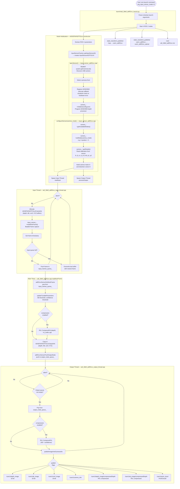

# Camera Sensor Mode — Deep Dive

## Overview

Camera Sensor Mode (`arg_input_sensor_mode:=0`) is the **live hardware mode** where the ROS 2 node directly interfaces with the EVAL-ADTF3175D-NXZ sensor over USB or SSH. The node reads raw depth, AB (Active Brightness), confidence, and XYZ frames in real time and publishes them as ROS 2 topics.

---

## Code Flow Diagram



---


```bash
ros2 launch adi_3dtof_adtf31xx adi_3dtof_adtf31xx_launch.py arg_input_sensor_mode:=0
```

> **Note:** The default value of `arg_input_sensor_mode` in the launch file is `3` (network mode). You must explicitly pass `arg_input_sensor_mode:=0` to activate camera sensor mode.

---

## Function Call Reference Table

| Step | Function | File | Arguments | Returns |
|------|----------|------|-----------|---------|
| **1** | `generate_launch_description()` | `launch/adi_3dtof_adtf31xx_launch.py` | — | `LaunchDescription` (4 nodes) |
| **2** | `ADI3DToFADTF31xx()` | `include/adi_3dtof_adtf31xx.h` | ROS 2 node params via `rclcpp::Node` | Node object |
| **3** | `InputSensorFactory::getInputSensor(int)` | `include/input_sensor_factory.h` | `input_sensor_type = 0` | `IInputSensor*` → `InputSensorADTF31XX*` |
| **4** | `InputSensorADTF31XX::openSensor(...)` | `src/input_sensor_adtf31xx.cpp` | `sensor_name, image_width, image_height, config_file_name, sensor_ip` | `void` |
| **4a** | `system.getCameraList(cameras)` | libaditof SDK | `cameras` (output vector) | `void` — populates camera list over USB |
| **4b** | `sensor->adsd3500_register_interrupt_callback(cb)` | libaditof SDK | Hardware interrupt callback lambda | `Status` |
| **4c** | `camera_->initialize(config_file_name)` | libaditof SDK | `config_file_name` — path to JSON config | `Status` — programs ADSD3500 |
| **5** | `InputSensorADTF31XX::configureSensor(int)` | `src/input_sensor_adtf31xx.cpp` | `camera_mode` (e.g. `3` = lr-qnative) | `void` |
| **5a** | `camera_->getAvailableModes(modes)` | libaditof SDK | `available_modes` (output vector) | `void` |
| **5b** | `camera_->getDetails(camera_details)` | libaditof SDK | `camera_details` (output struct) | `void` — reads `fx, fy, cx, cy, k1–k6, p1, p2` |
| **5c** | `camera_->setMode(camera_mode)` | libaditof SDK | `camera_mode` (int) | `Status` |
| **6** | `std::thread(&ADI3DToFADTF31xx::readInput, ...)` | `src/adi_3dtof_adtf31xx.cpp` (main) | `adi_3dtof_adtf31xx` shared_ptr | `std::thread` — input thread |
| **7** | `std::thread(&ADI3DToFADTF31xx::processOutput, ...)` | `src/adi_3dtof_adtf31xx.cpp` (main) | `adi_3dtof_adtf31xx` shared_ptr | `std::thread` — output thread |
| **8** | `ADI3DToFADTF31xx::readInput()` | `src/adi_3dtof_adtf31xx_input_thread.cpp` | — (continuous loop) | `void` |
| **8a** | `input_sensor_->readNextFrame(depth, ab, conf, xyz)` | `src/input_sensor_adtf31xx.cpp` | `unsigned short* depth, ab, conf`; `short* xyz` | `bool` — `true` on success |
| **8b** | `input_sensor_->getFrameTimestamp(timestamp)` | `src/input_sensor_adtf31xx.cpp` | `rclcpp::Time*` | `void` |
| **8c** | `input_frames_queue_.push(new_frame)` | `src/adi_3dtof_adtf31xx_input_thread.cpp` | `ADI3DToFADTF31xxFrameInfo*` | `void` — thread-safe push |
| **9** | `ADI3DToFADTF31xx::readNextFrame()` | `src/adi_3dtof_adtf31xx.cpp` | — (called by `rclcpp::spin`) | `bool` |
| **9a** | `updateTunableParameters()` | `src/adi_3dtof_adtf31xx.cpp` | — | `void` — applies AB/confidence thresholds at runtime |
| **9b** | `adtf31xxSensorGetNextFrame()` | `src/adi_3dtof_adtf31xx_input_thread.cpp` | — | `ADI3DToFADTF31xxFrameInfo*` — pops from `input_frames_queue_` |
| **9c** | `rvl.CompressRVL(input, output, numPixels)` | `src/ros-perception/.../rvl_codec.cpp` | `depth_frame*, compressed_buf*, image_width × image_height` | `int` — compressed byte size |
| **9d** | `adtf31xxSensorPushOutputNode(node)` | `src/adi_3dtof_adtf31xx_output_thread.cpp` | `ADI3DToFADTF31xxOutputInfo*` | `void` — pushes to `output_node_queue_` |
| **10** | `ADI3DToFADTF31xx::processOutput()` | `src/adi_3dtof_adtf31xx_output_thread.cpp` | — (continuous loop) | `void` |
| **10a** | `rvl.CompressRVL(ab, output, numPixels)` | `src/ros-perception/.../rvl_codec.cpp` | `ab_frame*, compressed_buf*, image_width × image_height` | `int` — compressed byte size |
| **10b** | `rvl.CompressRVL(conf, output, numPixels)` | `src/ros-perception/.../rvl_codec.cpp` | `conf_frame*, compressed_buf*, image_width × image_height` | `int` — compressed byte size |
| **10c** | `publishImageAndCameraInfo(frame)` | `src/adi_3dtof_adtf31xx_output_thread.cpp` | `ADI3DToFADTF31xxOutputInfo*` | `void` — publishes all enabled topics |
| **Shutdown** | `readInputAbort()` | `src/adi_3dtof_adtf31xx_input_thread.cpp` | — | `void` — sets `read_input_thread_abort_ = true` |
| **Shutdown** | `processOutputAbort()` | `src/adi_3dtof_adtf31xx_output_thread.cpp` | — | `void` — sets `process_output_thread_abort_ = true` |

---

## Prerequisites

| Requirement | Detail |
|---|---|
| Hardware | EVAL-ADTF3175D-NXZ connected via USB Type-C to Type-A (5 Gbps) |
| Firmware | Sensor firmware version **≥ 5.2.5.0** |
| SDK | `libaditof` built in the same ROS 2 workspace |
| Build flag | `SENSOR_CONNECTED=True` passed to `colcon build` |
| SSH | Node runs on the sensor itself — SSH into `analog@10.43.0.1` first |

---

## What Happens Internally

When you run the launch command with `arg_input_sensor_mode:=0`, the following sequence occurs:

### 1. InputSensorFactory selects `InputSensorADTF31XX`

In `input_sensor_factory.h`, the factory checks the mode value:

```cpp
case 0:
    input_sensor = new InputSensorADTF31XX;  // Live USB/direct sensor
```

This creates an instance of `InputSensorADTF31XX`, which wraps the `libaditof` SDK.

### 2. `openSensor()` — Discovers and initializes the camera

`InputSensorADTF31XX::openSensor()` (in `src/input_sensor_adtf31xx.cpp`) performs:

1. **Camera discovery** — Calls `system.getCameraList(cameras)` via `libaditof` to find all connected cameras over USB.
2. **Selects the first camera** — Uses `cameras.front()`.
3. **Registers a hardware interrupt callback** — Monitors ADSD3500 hardware interrupt status. If an error interrupt fires, the node shuts down via `rclcpp::shutdown()`.
4. **Initializes the camera** — Calls `camera_->initialize(config_file_name)` using the JSON config file (e.g., `config_adsd3500_adsd3100.json`), which programs the ADSD3500 depth processor.

### 3. `configureSensor()` — Sets camera mode and reads calibration

After initialization:

1. **Sets the imaging mode** — Calls `camera_->setMode(camera_mode)` with the value from `arg_camera_mode` (default: `3` = `lr-qnative`).
2. **Reads camera intrinsics** from the sensor's stored calibration data:
   - Focal lengths: `fx`, `fy`
   - Principal point: `cx`, `cy`
   - Radial distortion: `k1`, `k2`, `k3`, `k4`, `k5`, `k6`
   - Tangential distortion: `p1`, `p2`
3. **Builds the camera matrix**:

$$K = \begin{bmatrix} f_x & 0 & c_x \\ 0 & f_y & c_y \\ 0 & 0 & 1 \end{bmatrix}$$

These intrinsics are read directly from the sensor — not from any hardcoded defaults.

### 4. Input Thread — Continuous frame capture

`ADI3DToFADTF31xx::readInput()` (in `src/adi_3dtof_adtf31xx_input_thread.cpp`) runs in a dedicated thread:

- Allocates a new `ADI3DToFADTF31xxFrameInfo` buffer for each frame.
- Calls `input_sensor_->readNextFrame(depth, ab, conf, xyz)` which calls the `libaditof` frame capture API.
- Pushes the filled frame onto the **input queue** (thread-safe, mutex-protected).
- If the queue is full, the oldest frame is dropped to avoid memory buildup.

### 5. Output Thread — Processing and Publishing

`ADI3DToFADTF31xx::processOutput()` (in `src/adi_3dtof_adtf31xx_output_thread.cpp`) runs in a second dedicated thread:

- Dequeues frames from the input queue.
- Optionally applies **RVL lossless compression** to depth and AB frames (if `arg_enable_depth_ab_compression:=True`).
- Publishes enabled topics to ROS 2.

---

## ROS 2 Nodes Started by the Launch File

The launch file starts **four nodes** in the `cam1` namespace:

| Node | Package | Purpose |
|---|---|---|
| `adi_3dtof_adtf31xx_node` | `adi_3dtof_adtf31xx` | Main sensor node — captures and publishes frames |
| `cam1_adtf31xx_optical_tf` | `tf2_ros` | Static TF: `cam1_adtf31xx` → `cam1_adtf31xx_optical` (optical rotation −90° roll, −90° yaw) |
| `cam1_adtf31xx_tf` | `tf2_ros` | Static TF: `map` → `cam1_adtf31xx` (position from `arg_camera_height_from_ground_in_mtr`) |
| `rviz2` | `rviz2` | Visualization with the pre-configured `adi_3dtof_adtf31xx.rviz` layout |

### TF Tree

```
map
 └── cam1_adtf31xx          (position: x=0, y=0, z=arg_camera_height_from_ground_in_mtr)
      └── cam1_adtf31xx_optical   (rotation: roll=-1.57, pitch=0, yaw=-1.57)
```

---

## Published Topics (under `/cam1/` namespace)

| Topic | Type | Condition |
|---|---|---|
| `/cam1/depth_image` | `sensor_msgs/Image` (16-bit) | `arg_enable_depth_publish:=True` |
| `/cam1/ab_image` | `sensor_msgs/Image` (16-bit) | `arg_enable_ab_publish:=True` |
| `/cam1/conf_image` | `sensor_msgs/Image` (16-bit) | `arg_enable_conf_publish:=True` |
| `/cam1/camera_info` | `sensor_msgs/CameraInfo` | Always |
| `/cam1/depth_image/compressedDepth` | `sensor_msgs/CompressedImage` | `arg_enable_depth_ab_compression:=True` |
| `/cam1/ab_image/compressedDepth` | `sensor_msgs/CompressedImage` | `arg_enable_depth_ab_compression:=True` |
| `/cam1/point_cloud` | `sensor_msgs/PointCloud2` | `arg_enable_point_cloud_publish:=True` |

---

## Customizing the Launch Command

All parameters can be overridden on the command line:

```bash
ros2 launch adi_3dtof_adtf31xx adi_3dtof_adtf31xx_launch.py \
  arg_input_sensor_mode:=0 \
  arg_camera_mode:=1 \
  arg_ab_threshold:=20 \
  arg_confidence_threshold:=15 \
  arg_enable_point_cloud_publish:=True \
  arg_enable_depth_ab_compression:=True \
  arg_camera_height_from_ground_in_mtr:=0.25
```

### Key Parameters for Camera Sensor Mode

| Parameter | Recommended Value | Notes |
|---|---|---|
| `arg_input_sensor_mode` | `0` | Must be `0` for direct USB/sensor mode |
| `arg_camera_mode` | `1` (lr-native) or `3` (lr-qnative) | See Camera Modes table |
| `arg_config_file_name_of_tof_sdk` | `config_adsd3500_adsd3100.json` | Use `adsd3030` variant for VGA sensor |
| `arg_ab_threshold` | `10`–`30` | Higher value filters more noisy pixels |
| `arg_confidence_threshold` | `10`–`25` | Higher value keeps only high-confidence pixels |
| `arg_camera_height_from_ground_in_mtr` | Measure and set | Affects TF and point cloud ground position |

---

## Camera Sensor Mode vs Other Modes

| Aspect | Camera Sensor Mode (`0`) | File-IO Mode (`2`) | Network Mode (`3`) |
|---|---|---|---|
| Data source | Live USB sensor | Pre-recorded `.bin` file | Sensor over LAN/USB-network |
| Requires hardware | Yes | No | Yes (over network) |
| Requires `libaditof` | Yes | No | Yes |
| Real-time | Yes | Replay speed | Yes |
| Calibration source | Read from sensor | Hardcoded defaults | Read from sensor |
| Typical use | On-sensor deployment | Host PC evaluation | Host PC with live sensor |
