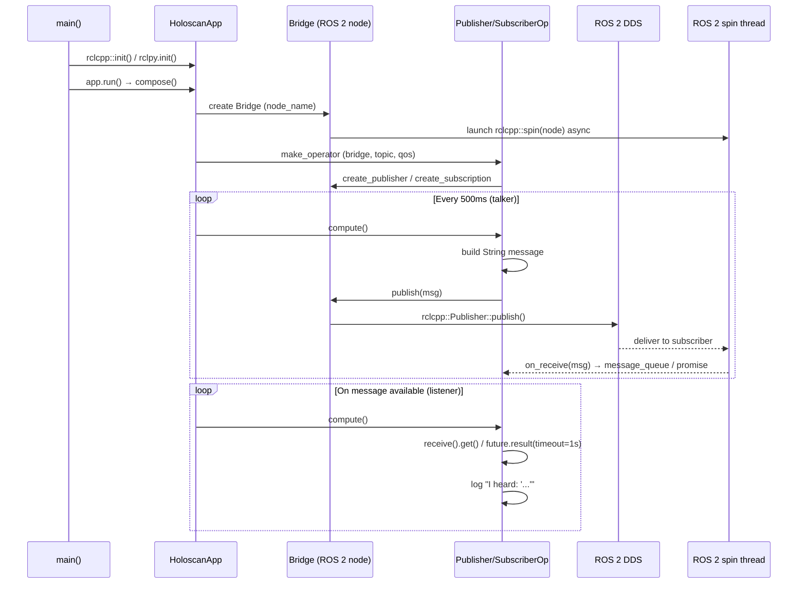
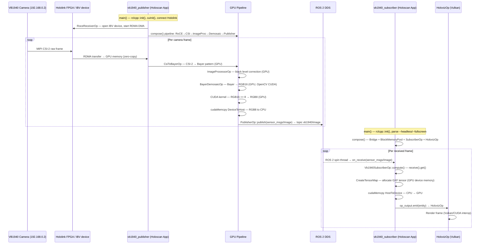

# Holoscan ROS 2 Application Examples — Deep Dive

Source: `holohub/applications/holoscan_ros2/` (holohub submodule, branch `adcam_ros2` @ tag `holoscan-sdk-3.9.0`)

---

## Overview

The `holoscan_ros2` directory contains example applications that bridge **NVIDIA Holoscan SDK** with **ROS 2**. Holoscan is NVIDIA's high-performance streaming AI SDK optimized for GPU-accelerated pipelines. These examples show how Holoscan operators can publish to and subscribe from ROS 2 topics, enabling integration with the broader ROS 2 ecosystem.

---

## Directory Structure

```
holohub/applications/holoscan_ros2/
├── CMakeLists.txt              # Top-level build — includes pubsub and vb1940
├── Dockerfile                  # Container for running holoscan_ros2 apps
├── README.md                   # Overview and architecture explanation
├── pubsub/                     # Basic publisher/subscriber examples
│   ├── CMakeLists.txt
│   ├── README.md
│   ├── cpp/                    # C++ implementation
│   │   ├── CMakeLists.txt
│   │   ├── metadata.json
│   │   ├── talker.cpp          # Holoscan → ROS 2 publisher
│   │   └── listener.cpp        # ROS 2 → Holoscan subscriber
│   └── python/                 # Python implementation
│       ├── CMakeLists.txt
│       ├── metadata.json
│       ├── talker.py           # Holoscan → ROS 2 publisher
│       └── listener.py         # ROS 2 → Holoscan subscriber
└── vb1940/                     # VB1940 Eagle camera examples (advanced)
    ├── CMakeLists.txt
    ├── Dockerfile
    ├── README.md
    └── cpp/
        ├── CMakeLists.txt
        ├── metadata.json
        ├── vb1940_publisher.cpp              # Camera capture → ROS 2 topic
        ├── vb1940_subscriber.cpp             # ROS 2 topic → visualization
        ├── convert_16bit_to_8bit_kernel.cu   # CUDA GPU kernel
        └── convert_16bit_to_8bit_kernel.h    # CUDA kernel header
```

---

## File Descriptions

### Root Files

| File | Description |
|------|-------------|
| `CMakeLists.txt` | Top-level CMake — includes both `pubsub` and `vb1940` subdirectories |
| `Dockerfile` | Docker image for running holoscan_ros2 applications with all dependencies (Holoscan SDK, ROS 2 Jazzy, NVIDIA container toolkit) |
| `README.md` | High-level overview: what ROS 2 is, why to integrate with Holoscan, use cases, and architecture |

---

### pubsub/ — Basic Publisher/Subscriber Examples

The simplest demonstration of bidirectional Holoscan ↔ ROS 2 communication using string messages.

| File | Description |
|------|-------------|
| `pubsub/CMakeLists.txt` | Builds both C++ and Python pubsub targets |
| `pubsub/README.md` | Build/run instructions, expected output, mode descriptions |
| `pubsub/cpp/CMakeLists.txt` | C++ build config — links against Holoscan SDK and ROS 2 |
| `pubsub/cpp/metadata.json` | Application metadata — declares `publisher` and `subscriber` modes used by the `holohub` CLI |
| `pubsub/cpp/talker.cpp` | **Holoscan → ROS 2 publisher** — `SimplePublisherOp` extends `holoscan::ros2::ops::PublisherOp<std_msgs::msg::String>`. Runs on a 500ms `PeriodicCondition`, publishes incrementing `"Hello, world! N"` strings to ROS 2 topic `topic`. Uses `holoscan::ros2::Bridge` resource. |
| `pubsub/cpp/listener.cpp` | **ROS 2 → Holoscan subscriber** — `SimpleSubscriberOp` extends `holoscan::ros2::ops::SubscriberOp<std_msgs::msg::String>`. Receives messages from ROS 2 topic and logs them via `HOLOSCAN_LOG_INFO`. |
| `pubsub/python/CMakeLists.txt` | Python build/install config |
| `pubsub/python/metadata.json` | Python application metadata with modes |
| `pubsub/python/talker.py` | Python equivalent of `talker.cpp` — Holoscan operator publishing string messages to ROS 2 |
| `pubsub/python/listener.py` | Python equivalent of `listener.cpp` — Holoscan operator receiving ROS 2 string messages |

#### Key Classes (pubsub C++)

| Class | Base Class | Role |
|---|---|---|
| `SimplePublisherOp` | `holoscan::ros2::ops::PublisherOp<std_msgs::msg::String>` | Publishes to ROS 2 topic `"topic"` every 500ms |
| `HoloscanSimplePublisherApp` | `holoscan::Application` | App that registers `SimplePublisherOp` and `holoscan::ros2::Bridge` |
| `SimpleSubscriberOp` | `holoscan::ros2::ops::SubscriberOp<std_msgs::msg::String>` | Receives from ROS 2 topic and logs messages |
| `HoloscanSimpleSubscriberApp` | `holoscan::Application` | App that registers `SimpleSubscriberOp` and `holoscan::ros2::Bridge` |

#### How to Run

```bash
# Build
./holohub build pubsub

# Run publisher (terminal 1)
./holohub run pubsub publisher --language cpp

# Run subscriber (terminal 2)
./holohub run pubsub subscriber --language cpp
```

---

### pubsub Code Flow — talker (Publisher)

#### C++ (`pubsub/cpp/talker.cpp`)

```
main()
  │
  ├─ rclcpp::init(argc, argv)          — initialise ROS 2 runtime
  │
  ├─ HoloscanSimplePublisherApp app
  │
  └─ app.run()                          — start Holoscan executor
         │
         └─ compose()
               │
               ├─ make_resource<Bridge>("holoscan_publisher_resource",
               │                        "holoscan_publisher_node")
               │     └─ creates rclcpp::Node("holoscan_publisher_node")
               │     └─ launches rclcpp::spin(node) in std::async thread
               │
               └─ make_operator<SimplePublisherOp>(
                       PeriodicCondition(500ms),     — fires every 500ms
                       Arg("ros2_bridge", bridge),
                       Arg("topic_name", "topic"),
                       Arg("qos", QoS(10)))
                         │
                         └─ initialize()
                               └─ bridge->create_publisher<String>("topic", QoS(10))

        ── executor fires every 500ms ──▶  SimplePublisherOp::compute()
               │
               ├─ msg.data = "Hello, world! " + std::to_string(count_++)
               ├─ HOLOSCAN_LOG_INFO("Publishing: '{}'", msg.data)
               └─ publish(msg)
                     └─ publisher_->publish(msg)
                           └─ rclcpp::Publisher::publish()  → DDS → ROS 2 topic "topic"
```

#### Python (`pubsub/python/talker.py`)

```
main()
  │
  ├─ logging.basicConfig(level=INFO)
  ├─ rclpy.init()                       — initialise ROS 2 runtime
  │
  └─ HoloscanSimplePublisherApp().run()
         │
         └─ __init__()
         │     └─ self.node = Node("holoscan_publisher_node")  ← explicit node creation
         │
         └─ compose()
               │
               ├─ Bridge(self, self.node, name="holoscan_publisher_resource")
               │     └─ wraps the rclpy Node; starts spin in background thread
               │
               └─ SimplePublisherOp(
                       self,
                       PeriodicCondition(recess_period=0.5),  — fires every 500ms
                       bridge,
                       topic_name="topic",
                       qos=10,
                       message_type=String)           ← Python requires explicit type
                         │
                         └─ initialize()
                               └─ bridge.create_publisher(String, "topic", 10)

        ── executor fires every 500ms ──▶  SimplePublisherOp.compute()
               │
               ├─ msg = String()
               ├─ msg.data = f"Hello, world! {self.count}"
               ├─ logging.info(f"Publishing: '{msg.data}'")
               ├─ self.publish(msg)
               │     └─ publisher_.publish(msg) → rclpy → DDS → ROS 2 topic "topic"
               └─ self.count += 1
```

**Key C++ vs Python difference (talker):**  In C++, `Bridge` creates the `rclcpp::Node` internally by name. In Python, the `Node` is created explicitly before `Bridge` and passed in — required because `rclpy` nodes need to be created on the main thread.

---

### pubsub Code Flow — listener (Subscriber)

#### C++ (`pubsub/cpp/listener.cpp`)

```
main()
  │
  ├─ rclcpp::init(argc, argv)
  │
  └─ HoloscanSimpleSubscriberApp app
         │
         └─ app.run()
               │
               └─ compose()
                     │
                     ├─ make_resource<Bridge>("holoscan_subscriber_resource",
                     │                        "holoscan_subscriber_node")
                     │     └─ creates rclcpp::Node, launches spin thread
                     │
                     └─ make_operator<SimpleSubscriberOp>(
                             Arg("ros2_bridge", bridge),
                             Arg("topic_name", "topic"),
                             Arg("qos", QoS(10)))
                               │
                               └─ initialize()
                                     └─ bridge->create_subscription<String>("topic", QoS(10))
                                           └─ registers on_receive() callback in ROS 2 spin thread

        ── ROS 2 spin thread ──▶  on_receive(msg)
               └─ if promise waiting → promise.set_value(msg)
                  else              → message_queue_.push(msg)

        ── Holoscan executor ──▶  SimpleSubscriberOp::compute()
               │
               └─ auto message = receive().get()
                     │
                     ├─ receive() → returns std::future<String>
                     │   ├─ if message in queue → future resolved immediately
                     │   └─ else → promise queued; blocks until on_receive() fires
                     │
                     └─ HOLOSCAN_LOG_INFO("I heard: '{}'", message.data)
```

#### Python (`pubsub/python/listener.py`)

```
main()
  │
  ├─ logging.basicConfig(level=INFO)
  ├─ rclpy.init()
  │
  └─ HoloscanSubscriberApp().run()
         │
         └─ __init__()
         │     └─ self.node = Node("holoscan_subscriber_node")
         │
         └─ compose()
               │
               ├─ Bridge(self, self.node, name="holoscan_subscriber_resource")
               │
               └─ MySubscriberOp(self, bridge)
                     └─ __init__: message_type=String, topic_name="topic", qos=10
                     └─ initialize():
                           └─ bridge.create_subscription(String, "topic", 10)
                                 └─ rclpy callback registered in spin thread

        ── rclpy spin thread ──▶  on_receive(msg)
               └─ if future waiting → future.set_result(msg)
                  else              → message_queue.push(msg)

        ── Holoscan executor ──▶  MySubscriberOp.compute()  (loop until message)
               │
               └─ while True:
                     │
                     ├─ future = self.receive()
                     │
                     ├─ message = future.result(timeout=1.0)   ← 1s timeout
                     │     ├─ TimeoutError → check rclpy.ok()
                     │     │     ├─ False → shutdown detected → return
                     │     │     └─ True  → continue waiting
                     │     └─ success → logging.info(f"I heard: '{message.data}'")
                     │                  return  (exit compute after one message)
```

**Key C++ vs Python difference (listener):**  In C++, `receive().get()` blocks the compute thread directly with no timeout — it simply waits on the `std::future`. In Python, a **timeout loop** is used (`future.result(timeout=1.0)`) so the thread can periodically check `rclpy.ok()` and exit gracefully on ROS 2 shutdown. This is necessary because Python threads don't support the same `std::future` cancellation model as C++.

---

### Full Flow Diagram — talker + listener together



---

### vb1940/ — VB1940 Eagle Camera Examples (Advanced)

> **C++ only** — unlike `pubsub` which has both C++ and Python implementations, `vb1940` is implemented in C++ only. This is because the camera SDK (`holoscan-sensor-bridge`) provides C++ APIs with no Python bindings.

Production-grade example using the VB1940 (Eagle) camera with a full GPU-accelerated pipeline publishing to ROS 2.

| File | Description |
|------|-------------|
| `vb1940/CMakeLists.txt` | Top-level build — includes `cpp/` subdirectory |
| `vb1940/Dockerfile` | Docker image with additional hololink and VB1940 camera dependencies |
| `vb1940/README.md` | Setup, network config (Hololink board IP: `192.168.0.2`), build and run instructions |
| `vb1940/cpp/CMakeLists.txt` | C++ build config — links against Holoscan SDK, hololink, ROS 2, CUDA |
| `vb1940/cpp/metadata.json` | Application metadata with `publisher` and `subscriber` modes |
| `vb1940/cpp/vb1940_publisher.cpp` | **Camera pipeline → ROS 2** — Full pipeline: RoCE receiver → CSI-to-Bayer → image processor → Bayer demosaic → CUDA 16-bit→8-bit conversion → `holoscan::ros2::ops::PublisherOp<sensor_msgs::msg::Image>` → ROS 2 topic `vb1940/image` |
| `vb1940/cpp/vb1940_subscriber.cpp` | **ROS 2 → visualization** — Subscribes to `vb1940/image` ROS 2 topic and visualizes using HoloViz |
| `vb1940/cpp/convert_16bit_to_8bit_kernel.cu` | **CUDA GPU kernel** — `convert_16bit_to_8bit_kernel` converts per-channel 16-bit pixel values to 8-bit by right-shifting 8 bits (`>> 8`), converting range 0–65535 → 0–255. Launched with 16×16 thread blocks. |
| `vb1940/cpp/convert_16bit_to_8bit_kernel.h` | CUDA kernel header — declares `launch_convert_16bit_to_8bit_kernel(input, output, width, height, channels)` |

#### VB1940 Publisher Pipeline

```
VB1940 Camera Hardware
    ↓
RoCE Receiver (roce_receiver_op)        — receives raw camera data over RDMA
    ↓
CSI-to-Bayer (csi_to_bayer)             — converts CSI raw stream to Bayer pattern
    ↓
Image Processor (image_processor)        — sensor-level image corrections
    ↓
Bayer Demosaic (bayer_demosaic)         — converts Bayer → RGB (GPU accelerated)
    ↓
CUDA Kernel (convert_16bit_to_8bit)     — converts 16-bit RGB → 8-bit RGB on GPU
    ↓
PublisherOp<sensor_msgs::msg::Image>    — publishes to ROS 2 topic: vb1940/image
```

#### CUDA Kernel Details

```cpp
// convert_16bit_to_8bit_kernel.cu
// For each pixel channel: output = input >> 8
// Input:  uint16_t [0–65535]
// Output: uint8_t  [0–255]
// Thread block: 16×16, Grid: ceil(width/16) × ceil(height/16)
```

#### How to Run

```bash
# Build (requires SSH access to hololink internal repo)
./holohub build vb1940 --build-args="--ssh default"

# Run publisher (terminal 1) — requires VB1940 camera hardware
./holohub run vb1940 publisher

# Run subscriber (terminal 2)
./holohub run vb1940 subscriber
```

---

### vb1940 Code Flow — Publisher (`vb1940_publisher.cpp`)

```
main()
  │
  ├─ rclcpp::init(argc, argv)              — initialise ROS 2
  ├─ Parse CLI args:
  │     --camera-mode  (default: 2560x1984 30FPS)
  │     --frame-limit  (default: 0 = unlimited)
  │     --hololink     (default: 192.168.0.2)
  │     --ibv-name     (default: first IBV device)
  │     --ibv-port     (default: 1)
  │
  ├─ cuInit(0)                             — initialise CUDA runtime
  ├─ Enumerate IBV devices (hololink::core::infiniband_devices())
  ├─ Connect to Hololink board via hololink::core::Enumerator (IP 192.168.0.2)
  ├─ Create NativeVb1940Sensor (camera) + set camera_mode
  │
  └─ HoloscanVb1940PublisherApplication app
         │
         └─ app.run() → compose()
               │
               ├─ camera_->set_mode(camera_mode_)        — configure sensor resolution/FPS
               │
               ├─ [Operator pipeline construction]
               │   ├─ RoceReceiverOp ("receiver")
               │   │     └─ opens IBV device, allocates RDMA buffer, starts camera DMA
               │   ├─ CsiToBayerOp ("csi_to_bayer")
               │   │     └─ converts packed MIPI CSI-2 → Bayer pattern (GPU)
               │   ├─ ImageProcessorOp ("image_processor")
               │   │     └─ optical black correction (value=8 for RAW10), pixel format conversion
               │   ├─ BayerDemosaicOp ("demosaic")
               │   │     └─ Bayer → RGB16 (OpenCV CUDA demosaic, generate_alpha=false)
               │   └─ Vb1940PublisherOp ("vb1940_publisher")
               │         └─ Bridge("vb1940_bridge_resource", "vb1940_bridge_node")
               │         └─ topic_name="vb1940/image", QoS(10)
               │
               └─ add_flow pipeline:
                   receiver → csi_to_bayer → image_processor → demosaic → vb1940_publisher

        ── per frame (each RoceReceiverOp trigger) ──▶  Vb1940PublisherOp::compute()
               │
               ├─ op_input.receive<gxf::Entity>("input")   — get RGB16 tensor from demosaic
               ├─ entity.findAll<gxf::Tensor>()             — extract tensor
               │
               ├─ [first frame only]
               │     ├─ Set message_.encoding = "rgb8"
               │     ├─ Set message_.width, height, step
               │     └─ message_.data.resize(width * height * 3 * sizeof(uint8_t))
               │
               ├─ cudaMalloc(&d_rgb8_buffer_, output_size)  — allocate GPU 8-bit buffer (once)
               │
               ├─ launch_convert_16bit_to_8bit_kernel(      — CUDA kernel: >> 8 per channel
               │       tensor_ptr,           ← RGB16 on GPU
               │       d_rgb8_buffer_,       ← output RGB8 on GPU
               │       width, height, 3)
               │
               ├─ message_.header.stamp = rclcpp::Clock().now()
               │
               ├─ cudaMemcpy(message_.data.data(),          — GPU → CPU (device to host)
               │             d_rgb8_buffer_, size,
               │             cudaMemcpyDeviceToHost)
               │
               └─ publish(message_)
                     └─ rclcpp::Publisher::publish()  → DDS → topic "vb1940/image"
```

---

### vb1940 Code Flow — Subscriber (`vb1940_subscriber.cpp`)

```
main()
  │
  ├─ rclcpp::init(argc, argv)
  ├─ Parse CLI args: --headless, --fullscreen
  │
  └─ HoloscanVb1940SubscriberApplication app(headless, fullscreen)
         │
         └─ app.run() → compose()
               │
               ├─ Bridge("vb1940_subscriber_bridge_resource",
               │          "vb1940_subscriber_bridge_node")
               │     └─ creates rclcpp::Node, launches spin thread
               │
               ├─ BlockMemoryPool ("pool")
               │     └─ device memory, block_size = 2560×1984×3 bytes (max RGB8 frame)
               │     └─ num_blocks = 2
               │
               ├─ Vb1940SubscriberOp ("vb1940_subscriber")
               │     ├─ topic_name = "vb1940/image"
               │     ├─ QoS(10)
               │     ├─ pool = tensor_pool
               │     └─ message_queue_max_size = 3  ← drop old frames if pipeline lags
               │
               ├─ HolovizOp ("holoviz")
               │     ├─ fullscreen, headless
               │     ├─ framebuffer_srgb = true
               │     └─ enable_cuda_interop = true
               │
               └─ add_flow(subscriber, visualizer, {{"output", "receivers"}})

        ── ROS 2 spin thread ──▶  on_receive(sensor_msgs::Image)
               └─ message pushed to message_queue_ (or promise resolved)

        ── Holoscan executor ──▶  Vb1940SubscriberOp::compute()
               │
               ├─ auto message = receive().get()          — blocking wait on std::future
               │
               ├─ CreateTensorMap(context,                — allocate GXF tensor
               │       allocator,
               │       shape = {height, width, 3},        — RGB
               │       type  = kUnsigned8,                — uint8_t
               │       storage = kDevice)                 — GPU memory
               │
               ├─ cudaMemcpy(tensor_ptr,                  — CPU → GPU (host to device)
               │             message.data.data(),
               │             message.data.size(),
               │             cudaMemcpyHostToDevice)
               │
               └─ op_output.emit(entity, "output")        — send tensor to HolovizOp
                     └─ HolovizOp renders frame on screen (Vulkan/CUDA interop)
```

---

### vb1940 Full Flow Diagram — Publisher + Subscriber together



---

### vb1940 Publisher — Step-by-Step Summary

| Step | Where | What happens |
|---|---|---|
| 1 | `main()` | `rclcpp::init()`, `cuInit()`, parse CLI args |
| 2 | `main()` | Enumerate IBV devices, connect Hololink board at `192.168.0.2` |
| 3 | `main()` | Create `NativeVb1940Sensor`, set `camera_mode` |
| 4 | `compose()` | Build 5-operator pipeline: `RoCE → CSI → ImgProc → Demosaic → Publisher` |
| 5 | `RoceReceiverOp` | Opens IBV device, allocates RDMA buffer, starts camera DMA |
| 6 | `CsiToBayerOp` | Converts MIPI CSI-2 packed raw → Bayer pattern on GPU |
| 7 | `ImageProcessorOp` | Applies optical black correction (value=8, RAW10 format) |
| 8 | `BayerDemosaicOp` | Converts Bayer → RGB16 using OpenCV CUDA demosaic |
| 9 | `Vb1940PublisherOp::compute()` | CUDA kernel `>> 8`: RGB16 → RGB8 on GPU |
| 10 | `Vb1940PublisherOp::compute()` | `cudaMemcpy DeviceToHost`: RGB8 → CPU RAM |
| 11 | `Vb1940PublisherOp::compute()` | `publish(sensor_msgs/Image)` → ROS 2 topic `vb1940/image` |

### vb1940 Subscriber — Step-by-Step Summary

| Step | Where | What happens |
|---|---|---|
| 1 | `main()` | `rclcpp::init()`, parse `--headless` / `--fullscreen` |
| 2 | `compose()` | Create `Bridge` + ROS 2 node + spin thread |
| 3 | `compose()` | Create `BlockMemoryPool` (GPU device memory, 2 blocks, max frame size) |
| 4 | `compose()` | Create `Vb1940SubscriberOp` with `message_queue_max_size=3` |
| 5 | `compose()` | Create `HolovizOp` with Vulkan/CUDA interop enabled |
| 6 | `compose()` | Connect: `subscriber["output"] → holoviz["receivers"]` |
| 7 | ROS 2 spin thread | `on_receive(sensor_msgs/Image)` → push to `message_queue_` |
| 8 | `Vb1940SubscriberOp::compute()` | `receive().get()` — blocks until frame arrives |
| 9 | `Vb1940SubscriberOp::compute()` | `CreateTensorMap` — allocate GXF tensor on GPU |
| 10 | `Vb1940SubscriberOp::compute()` | `cudaMemcpy HostToDevice`: CPU → GPU |
| 11 | `Vb1940SubscriberOp::compute()` | `op_output.emit(entity)` → HolovizOp |
| 12 | `HolovizOp` | Render frame using Vulkan/CUDA interop — zero GPU copy to display |

| Aspect | pubsub `SimplePublisherOp` | vb1940 `Vb1940PublisherOp` |
|---|---|---|
| Input | None (generates data internally) | `spec.input<gxf::Entity>("input")` from demosaic |
| Data source | Synthetic string | RGB16 tensor from GPU pipeline |
| GPU work | None | CUDA kernel `>> 8` per channel |
| Memory | None | `cudaMalloc` + `cudaMemcpy DeviceToHost` |
| Message type | `std_msgs/String` | `sensor_msgs/Image` (rgb8) |

| Aspect | pubsub `SimpleSubscriberOp` | vb1940 `Vb1940SubscriberOp` |
|---|---|---|
| Output | None (logs to console) | `spec.output<gxf::Entity>("output")` to HolovizOp |
| GPU work | None | `cudaMemcpy HostToDevice` + tensor allocation |
| Memory pool | None | `BlockMemoryPool` (GPU device memory) |
| Queue size | Unlimited | 3 (drops stale frames) |
| Visualization | Console log | HolovizOp (Vulkan/CUDA display) |

---

## Holoscan ↔ ROS 2 Bridge Architecture

Source path: `holohub/operators/holoscan_ros2/`

The bridge layer lives in the `holoscan_ros2` **operator package** (separate from the application examples). It provides all the classes needed to connect Holoscan pipelines to ROS 2 topics. The full file tree is:

```
holohub/operators/holoscan_ros2/
├── CMakeLists.txt
├── metadata.json
├── README.md
├── cpp/
│   ├── CMakeLists.txt
│   └── holoscan/ros2/
│       ├── bridge.hpp          ← Core ROS 2 node manager + pub/sub factory
│       ├── operator.hpp        ← Base class for all Holoscan ROS 2 operators
│       ├── qos.hpp             ← QoS wrapper for Holoscan parameter system
│       ├── yaml_converter.hpp  ← YAML serialisation helpers (prevents Holoscan YAML system from failing on unsupported QoS type)
│       └── operators/
│           ├── publisher.hpp   ← Template publisher operator
│           └── subscriber.hpp  ← Template subscriber operator
└── python/
    └── holoscan_ros2/
        ├── __init__.py
        ├── bridge.py
        ├── operator.py
        └── operators/
            ├── __init__.py
            ├── publisher.py    ← Python publisher operator
            └── subscriber.py   ← Python subscriber operator
```

---

### `bridge.hpp` — `holoscan::ros2::Bridge`

**File:** `holohub/operators/holoscan_ros2/cpp/holoscan/ros2/bridge.hpp`

The `Bridge` is a `holoscan::Resource` that owns and manages the `rclcpp::Node` inside a Holoscan application. It is the **single point of contact** between the Holoscan executor and the ROS 2 runtime.

#### Key responsibilities

| Responsibility | How |
|---|---|
| Create the ROS 2 node | Constructor: `Bridge(node_name)` → `std::make_shared<rclcpp::Node>(node_name)` |
| Spin the ROS 2 node | `initialize()` launches `rclcpp::spin(node)` in a `std::async` background thread |
| Shut down ROS 2 | Destructor calls `rclcpp::shutdown()` when `spin_future_` is valid |
| Factory for publishers | `create_publisher<MsgT>(topic, qos)` → wraps `node->create_publisher<MsgT>()` |
| Factory for subscribers | `create_subscription<MsgT>(topic, qos)` → wraps `node->create_subscription<MsgT>()` with `on_receive` callback |

#### `Bridge::Publisher<MessageT>`

Inner template class — wraps `rclcpp::Publisher<MessageT>`:

```cpp
template <typename MessageT>
class Publisher {
    void publish(const MessageType& message);  // calls rclcpp publisher_->publish()
};
```

#### `Bridge::Subscriber<MessageT, ContainerT>`

Inner template class — wraps `rclcpp::Subscription<MessageT>` with an internal **promise/future queue** for asynchronous message delivery:

```
ROS 2 DDS layer
    ↓  on_receive() callback (ROS 2 spin thread)
    ↓
[ message_queue_ ] ←→ mutex_
    ↓  receive() called from Holoscan compute() thread
    ↓
std::future<MessageT>  — resolved with next available message
```

**Queue behaviour:**
- If a `receive()` call arrives before a message → a `std::promise` is queued; resolved when message arrives
- If a message arrives before `receive()` → message is pushed to `message_queue_`
- If `message_queue_max_size > 0` and queue is full → message is dropped with a `HOLOSCAN_LOG_WARN`

---

### `operator.hpp` — `holoscan::ros2::Operator`

**File:** `holohub/operators/holoscan_ros2/cpp/holoscan/ros2/operator.hpp`

Base class for all Holoscan ROS 2 operators. Extends `holoscan::Operator` and adds the `ros2_bridge` parameter.

```cpp
class Operator : public holoscan::Operator {
    void setup(OperatorSpec& spec) {
        spec.param(ros2_bridge_, "ros2_bridge", ...);  // declares the Bridge parameter
    }
    void initialize() {
        assert(ros2_bridge_.get()->valid());  // verifies Bridge is initialised
    }
protected:
    BridgePtr ros2_bridge();  // accessor for subclasses
};
```

Every `PublisherOp` and `SubscriberOp` inherits from this — they all share a single `Bridge` resource passed as `holoscan::Arg("ros2_bridge", bridge)`.

---

### `operators/publisher.hpp` — `holoscan::ros2::ops::PublisherOp<MessageT>`

**File:** `holohub/operators/holoscan_ros2/cpp/holoscan/ros2/operators/publisher.hpp`

Template operator for publishing any ROS 2 message type from a Holoscan pipeline.

#### Class signature
```cpp
template <typename MessageT>
class PublisherOp : public holoscan::ros2::Operator { ... };
```

#### Parameters (declared in `setup()`)

| Parameter | Type | Required | Description |
|---|---|---|---|
| `ros2_bridge` | `BridgePtr` | Yes | Shared Bridge resource (inherited from `Operator`) |
| `topic_name` | `std::string` | Yes | ROS 2 topic name to publish to |
| `qos` | `holoscan::ros2::QoS` | No | QoS profile — defaults to `rmw_qos_profile_default` |

#### Lifecycle

| Method | What happens |
|---|---|
| `setup(spec)` | Registers `topic_name` and `qos` parameters; calls `register_converter<QoS>()` |
| `initialize()` | Calls `ros2_bridge()->create_publisher<MessageT>(topic_name, qos)` → creates `Bridge::Publisher` |
| `compute()` | User override — call `publish(message)` to send |
| `publish(msg)` | Calls `publisher_->publish(msg)` → `rclcpp::Publisher::publish()` |

#### Usage pattern (C++)
```cpp
class MyPublisherOp : public holoscan::ros2::ops::PublisherOp<sensor_msgs::msg::Image> {
public:
    HOLOSCAN_OPERATOR_FORWARD_ARGS_SUPER(MyPublisherOp,
        holoscan::ros2::ops::PublisherOp<sensor_msgs::msg::Image>)

    void compute(InputContext&, OutputContext&, ExecutionContext&) override {
        sensor_msgs::msg::Image msg;
        // fill msg...
        publish(msg);
    }
};

// In Application::compose():
auto bridge = make_resource<holoscan::ros2::Bridge>("bridge", "my_node");
auto pub_op = make_operator<MyPublisherOp>("pub",
    holoscan::Arg("ros2_bridge", bridge),
    holoscan::Arg("topic_name", std::string("/cam1/depth_image")),
    holoscan::Arg("qos", holoscan::ros2::QoS(10)));
```

---

### `operators/subscriber.hpp` — `holoscan::ros2::ops::SubscriberOp<MessageT>`

**File:** `holohub/operators/holoscan_ros2/cpp/holoscan/ros2/operators/subscriber.hpp`

Template operator for subscribing to any ROS 2 topic inside a Holoscan pipeline.

#### Class signature
```cpp
template <typename MessageT, template <typename> class ContainerT = std::deque>
class SubscriberOp : public holoscan::ros2::Operator { ... };
```

The `ContainerT` template parameter allows swapping the internal message buffer container (default: `std::deque`).

#### Parameters (declared in `setup()`)

| Parameter | Type | Required | Description |
|---|---|---|---|
| `ros2_bridge` | `BridgePtr` | Yes | Shared Bridge resource |
| `topic_name` | `std::string` | Yes | ROS 2 topic name to subscribe to |
| `qos` | `holoscan::ros2::QoS` | No | QoS profile |
| `message_queue_max_size` | `size_type` | No | Max buffered messages — `0` = unlimited (default) |

#### Lifecycle

| Method | What happens |
|---|---|
| `setup(spec)` | Registers `topic_name`, `qos`, `message_queue_max_size` |
| `initialize()` | Calls `ros2_bridge()->create_subscription<MessageT>(topic_name, qos)` |
| `compute()` | User override — call `receive()` to get next message |
| `receive()` | Returns `std::future<MessageT>` — call `.get()` to block until message arrives |

#### Usage pattern (C++)
```cpp
class MySubscriberOp : public holoscan::ros2::ops::SubscriberOp<sensor_msgs::msg::Image> {
public:
    HOLOSCAN_OPERATOR_FORWARD_ARGS_SUPER(MySubscriberOp,
        holoscan::ros2::ops::SubscriberOp<sensor_msgs::msg::Image>)

    void compute(InputContext&, OutputContext&, ExecutionContext&) override {
        auto msg = receive().get();  // blocks until message available
        // process msg...
    }
};
```

---

### `qos.hpp` — `holoscan::ros2::QoS`

**File:** `holohub/operators/holoscan_ros2/cpp/holoscan/ros2/qos.hpp`

A thin wrapper around `rclcpp::QoS` that integrates with Holoscan's parameter/YAML system.

```cpp
class QoS : public rclcpp::QoS {
    QoS() : rclcpp::QoS(rmw_qos_profile_default) {}  // default constructor
    using rclcpp::QoS::QoS;  // all rclcpp::QoS constructors available
};
```

Typical usage: `holoscan::ros2::QoS(10)` — creates a QoS with history depth 10.

---

### `yaml_converter.hpp` — YAML Converter

**File:** `holohub/operators/holoscan_ros2/cpp/holoscan/ros2/yaml_converter.hpp`

Holoscan's parameter system uses YAML for serialisation/deserialisation of operator parameters. Since `holoscan::ros2::QoS` is not a built-in Holoscan type, it cannot be automatically converted to/from YAML. This header declares it as unsupported to prevent silent failures:

```cpp
ROS2_DECLARE_YAML_CONVERTER_UNSUPPORTED(holoscan::ros2::QoS)  // NOLINT
```

This means `QoS` parameters **cannot** be set from a YAML config file — they must be passed as `holoscan::Arg("qos", holoscan::ros2::QoS(10))` in C++ code.

---

### Python Equivalents

| C++ class | Python class | File |
|---|---|---|
| `holoscan::ros2::Bridge` | `Bridge` | `python/holoscan_ros2/bridge.py` |
| `holoscan::ros2::Operator` | `Operator` | `python/holoscan_ros2/operator.py` |
| `PublisherOp<MsgT>` | `PublisherOp` | `python/holoscan_ros2/operators/publisher.py` |
| `SubscriberOp<MsgT>` | `SubscriberOp` | `python/holoscan_ros2/operators/subscriber.py` |

**Key differences in Python implementations:**

- **`bridge.py`** — Takes an existing `rclpy.node.Node` object (must be created on the main thread before Bridge), then wraps it and starts `rclpy.spin()` in a daemon background thread. Unlike C++, there is no internal node creation by name.
- **`operator.py`** — Python base operator that stores the `bridge` reference and exposes `ros2_bridge()` accessor. Equivalent to C++ `holoscan::ros2::Operator`.
- **`publisher.py`** — Requires explicit `message_type` constructor argument (e.g. `message_type=std_msgs.msg.String`) since Python has no templates. Calls `bridge.create_publisher(message_type, topic_name, qos)` in `initialize()`.
- **`subscriber.py`** — Requires `message_type` + optional `message_queue_max_size`. Returns `concurrent.futures.Future` from `receive()` instead of `std::future`. Uses `future.result(timeout=1.0)` with a shutdown-check loop for graceful exit (Python cannot cancel a blocking future like C++).

Python `PublisherOp` and `SubscriberOp` require `message_type` as an explicit constructor argument (since Python has no templates):

```python
pub_op = PublisherOp(self,
    ros2_bridge=bridge,
    topic_name="/cam1/depth_image",
    message_type=sensor_msgs.msg.Image,
    qos=10)
```

---

### Complete Class Hierarchy

```
holoscan::Operator
    └── holoscan::ros2::Operator          (operator.hpp — adds ros2_bridge param)
            ├── holoscan::ros2::ops::PublisherOp<MsgT>   (publisher.hpp)
            │       └── SimplePublisherOp  (talker.cpp / user subclass)
            └── holoscan::ros2::ops::SubscriberOp<MsgT>  (subscriber.hpp)
                    └── SimpleSubscriberOp (listener.cpp / user subclass)

holoscan::Resource
    └── holoscan::ros2::Bridge            (bridge.hpp — owns rclcpp::Node, spins in background)
            ├── Bridge::Publisher<MsgT>   (inner class — wraps rclcpp::Publisher)
            └── Bridge::Subscriber<MsgT>  (inner class — wraps rclcpp::Subscription + promise queue)
```

---

## Prerequisites

| Requirement | Version / Detail |
|---|---|
| **Host Device** | NVIDIA AGX Thor |
| **JetPack** | 7.0 |
| **Holoscan Sensor Bridge** | 2.5.0 (`holoscan-sensor-bridge` → branch `demo_HSB_ToF_ROS2`) |
| **Holoscan SDK** | 3.9.0 |
| **holohub** | branch `adcam_ros2` (pinned to tag `holoscan-sdk-3.9.0`) |
| **ROS 2** | Jazzy (tested) |
| **Docker** | With NVIDIA Container Toolkit |
| **NVIDIA GPU Driver** | JetPack 7.0 compatible |
| VB1940 camera *(vb1940 only)* | Eagle camera + hololink repo access |

---

## Relevance to ADI 3DToF ADTF31xx

The `pubsub` and `vb1940` patterns in holohub directly inform how a **Holoscan-based ADI ToF pipeline** could be built. The current `adi_3dtof_adtf31xx` package uses pure ROS 2 (`rclcpp`), but the Holoscan bridge operators enable migrating to a GPU-accelerated Holoscan pipeline while keeping ROS 2 compatibility.

### Current Architecture (adi_3dtof_adtf31xx — Pure ROS 2)

```
ADTF3175 ToF Sensor (USB / 10.43.0.1)
    ↓  libaditof SDK (InputSensorADTF31XX)
    ↓  raw depth/AB/conf/XYZ frames
readInput() thread → input_frames_queue_
    ↓
readNextFrame() → optional RVL compress
    ↓ output_node_queue_
processOutput() → publishImageAndCameraInfo()
    ↓
rclcpp::Publisher → /cam1/depth_image
                  → /cam1/ab_image
                  → /cam1/conf_image
                  → /cam1/camera_info
                  → /cam1/point_cloud
```

### Future Architecture (Holoscan-based)

Using the `PublisherOp` pattern from holohub, the same pipeline could be implemented as:

```
ADTF3175 ToF Sensor
    ↓  libaditof SDK → custom Holoscan operator (DepthCaptureOp)
    ↓  depth/AB tensors on GPU
Optional CUDA processing (filtering, point cloud projection)
    ↓
PublisherOp<sensor_msgs::msg::Image>(topic="/cam1/depth_image", qos=10)
PublisherOp<sensor_msgs::msg::Image>(topic="/cam1/ab_image", qos=10)
PublisherOp<sensor_msgs::msg::PointCloud2>(topic="/cam1/point_cloud", qos=10)
```

### Comparison: adi_3dtof_adtf31xx vs holohub patterns

| Aspect | ADI 3DToF node (current) | Holoscan approach (from holohub) |
|---|---|---|
| Framework | ROS 2 (`rclcpp`) | Holoscan SDK + ROS 2 bridge |
| Sensor input | `libaditof` via `InputSensorADTF31XX` | Custom `DepthCaptureOp` wrapping `libaditof` |
| Publisher API | `rclcpp::Publisher::publish()` | `holoscan::ros2::ops::PublisherOp` |
| Threading | Manual (`std::thread` input/output) | Holoscan executor manages scheduling |
| GPU processing | Optional (RVL compression only) | Core design — CUDA operations in operators |
| Compression | RVL lossless (custom) | Not needed (GPU-direct pipeline) |
| Point cloud | CPU-side LUT projection | Could be GPU-side with CUDA operator |
| Sensor data | Depth (16-bit), AB, conf, XYZ | Any sensor type via custom operator |

### Adapting `PublisherOp` for ToF depth images

```cpp
// Minimal example: publish depth image from Holoscan operator
class DepthPublisherOp : public holoscan::ros2::ops::PublisherOp<sensor_msgs::msg::Image> {
public:
    HOLOSCAN_OPERATOR_FORWARD_ARGS_SUPER(DepthPublisherOp,
        holoscan::ros2::ops::PublisherOp<sensor_msgs::msg::Image>)

    void compute(InputContext& op_input, OutputContext&, ExecutionContext&) override {
        auto depth_tensor = op_input.receive<holoscan::gxf::Entity>("depth");
        sensor_msgs::msg::Image msg;
        msg.header.stamp = rclcpp::Clock().now();
        msg.encoding     = "mono16";
        msg.width        = image_width_;
        msg.height       = image_height_;
        // copy depth data to msg.data...
        publish(msg);
    }
};
```
